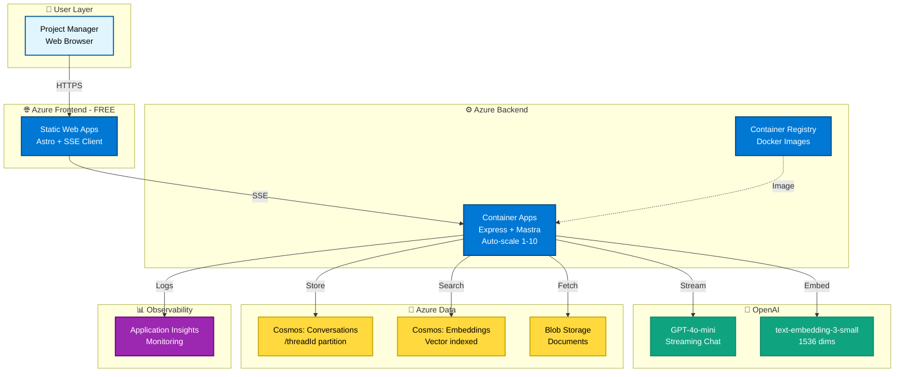
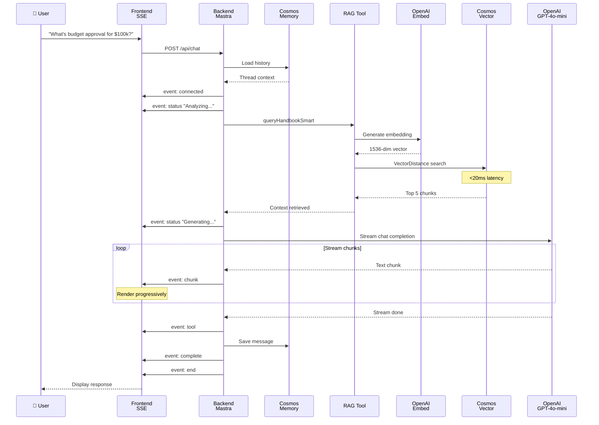

# ProjectPal - AI Project Management Assistant

[](https://github.com/CodeSaurabhCode/ProjectPal/actions/workflows/pr-validation.yml)
[](https://github.com/CodeSaurabhCode/ProjectPal/actions/workflows/deploy-apps.yml)

AI-powered project management assistant with real-time streaming, RAG capabilities, and Azure serverless infrastructure.

**Key Features:**
- 🤖 Real-time streaming responses (SSE)
- 💾 Conversation memory (thread-based)
- 📚 RAG with Cosmos DB vector search
- 🚀 Auto-scaling serverless (Azure)
- 💰 Cost-optimized ($26-41/month)

---

## 🚀 Quick Start

### Prerequisites
- Node.js 20.9+
- OpenAI API key ([Get here](https://platform.openai.com/api-keys))

### Run Locally (5 minutes)

```powershell
# 1. Clone repository
git clone https://github.com/CodeSaurabhCode/ProjectPal.git
cd ProjectPal

# 2. Setup backend
cd backend
npm install --legacy-peer-deps
cp .env.example .env
# Edit .env: Add OPENAI_API_KEY=sk-...
npm run server:dev    # → http://localhost:3001

# 3. Setup frontend (new terminal)
cd frontend
npm install
npm run dev           # → http://localhost:4321

# 4. Open browser → http://localhost:4321
```

### Environment Variables

**Backend `.env`:**
```bash
OPENAI_API_KEY=sk-...              # Required
MEMORY_STORAGE_TYPE=file           # 'file' (dev) or 'cosmos' (prod)
PORT=3001
FRONTEND_URL=http://localhost:4321
```

**Frontend `.env`:**
```bash
PUBLIC_BACKEND_URL=http://localhost:3001
```

---

## 📋 What It Does

**Team Management:**
- "Who are the available data scientists?"
- "Find frontend developers"

**Policy Queries (RAG):**
- "What's the budget approval process for $100k?"
- "How do I submit a project proposal?"

**Ticket Creation:**
- "Create a kickoff ticket for AI chatbot project"
- "Create high priority ticket, assign to Sarah"

---

## 🏗️ Architecture

**Tech Stack:**
- Frontend: Astro + TypeScript (Azure Static Web Apps)
- Backend: Node.js + Express + Mastra (Container Apps)
- AI: OpenAI GPT-4o-mini + text-embedding-3-small
- Data: Cosmos DB (vector search) + Blob Storage
- Infrastructure: Terraform + GitHub Actions

**How It Works:**
1. User sends message → Frontend (Astro SSE client)
2. Backend validates → Mastra Agent analyzes intent
3. Agent executes tools if needed (RAG search, team lookup)
4. OpenAI GPT-4o-mini generates response
5. SSE streams response word-by-word to frontend
6. Conversation saved to memory (Cosmos DB or local files)

**Streaming:**
- Protocol: Server-Sent Events (SSE)
- TTFC: 300-800ms
- Events: `connected`, `status`, `chunk`, `tool`, `complete`, `end`
- See [STREAMING_IMPLEMENTATION.md](docs/STREAMING_IMPLEMENTATION.md)

**RAG Pipeline:**
- Cosmos DB native vector search (quantizedFlat, 1536 dims, cosine)
- Vector search: <20ms latency
- Cost: $0-2/month (vs $40+ alternatives)
- See [EMBEDDINGS_ARCHITECTURE.md](docs/EMBEDDINGS_ARCHITECTURE.md)

---

## 🛠️ AI Tools

**1. Team Directory** - Find team members by role, availability, skills  
**2. PM Handbook RAG** - Search PM handbook using vector embeddings  
**3. Ticket Creation** - Create and assign project tickets

---

## 📚 API Endpoints

### `POST /api/chat` (SSE Streaming)
Real-time streaming with Server-Sent Events.

**Events:** `connected`, `status`, `chunk`, `tool`, `complete`, `error`, `end`

### `POST /api/chat-simple` (JSON)
Non-streaming endpoint for simple responses.

### `GET /api/health`
Health check endpoint.

---

## 🏛️ System Architecture

### High-Level Architecture



### Chat Session Flow



---

## 📁 Project Structure

```
ProjectPal/
├── backend/
│   ├── src/
│   │   ├── mastra/               # AI agent + tools
│   │   ├── routes/chat.ts        # SSE streaming endpoint
│   │   └── server.ts             # Express app
│   ├── memory/                   # Conversation storage
│   └── Dockerfile
│
├── frontend/
│   ├── src/
│   │   ├── components/Chat/      # UI components
│   │   ├── scripts/chat.ts       # SSE client
│   │   └── pages/index.astro     # Main page
│   └── astro.config.mjs
│
├── terraform/                    # Infrastructure as Code
├── .github/workflows/            # CI/CD pipelines
└── docs/                         # Documentation
```

---

## 🚢 Deployment

### Deploy to Azure (10 minutes)

```powershell
# 1. Login to Azure
az login

# 2. Initialize & configure
cd terraform
terraform init
cp terraform.tfvars.example terraform.tfvars
# Edit: Add openai_api_key, subscription_id

# 3. Deploy
terraform apply
```

**What Gets Deployed:**
- Static Web Apps (Frontend) - FREE
- Container Apps (Backend) - Auto-scaling
- Cosmos DB - Vector search
- Blob Storage - Documents
- Container Registry - Docker images
- Application Insights - Monitoring
**Cost:** $26-41/month (20-45% under $50 budget)

### CI/CD
GitHub Actions automatically deploys on push to `main`. See [DEPLOYMENT.md](DEPLOYMENT.md) for setup.

---
---

## 📖 Documentation

**Technical Guides:**
- [STREAMING_IMPLEMENTATION.md](docs/STREAMING_IMPLEMENTATION.md) - SSE streaming with Mastra
- [EMBEDDINGS_ARCHITECTURE.md](docs/EMBEDDINGS_ARCHITECTURE.md) - Cosmos DB vector search
- [ARCHITECTURE_DIAGRAMS.md](docs/ARCHITECTURE_DIAGRAMS.md) - Visual architecture (12 diagrams)

**Submission Documents:**
- [01_Executive_Summary.md](docs/submission/01_Executive_Summary.md)
- [02_Conceptual_Design.md](docs/submission/02_Conceptual_Design.md)
- [03_Azure_Architecture.md](docs/submission/03_Azure_Architecture.md)
- [04_Service_Rationale.md](docs/submission/04_Service_Rationale.md)

**Setup:**
- [DEPLOYMENT.md](DEPLOYMENT.md) - Azure deployment guide
- [backend/MEMORY_SETUP.md](backend/MEMORY_SETUP.md) - Memory configuration
- [.github/CICD_SETUP.md](.github/CICD_SETUP.md) - CI/CD setup

---

## 🤝 Contributing

1. Fork repository
2. Create feature branch
3. Commit changes
4. Push and open PR

---

## 📄 License

MIT License

---

**Built with ❤️ using Astro, Mastra, and Azure**AI key, deployment tokens)
3. Push to `main` → automatic deployment! 🚀


- **Issues**: [GitHub Issues](https://github.com/CodeSaurabhCode/ProjectPal/issues)
- **Discussions**: [GitHub Discussions](https://github.com/CodeSaurabhCode/ProjectPal/discussions)

---

**Built with ❤️ using Astro, Mastra, and Azure**
