# ProjectPal - AI Project Management Assistant

[](https://github.com/CodeSaurabhCode/ProjectPal/actions/workflows/pr-validation.yml)
[](https://github.com/CodeSaurabhCode/ProjectPal/actions/workflows/deploy-apps.yml)

AI-powered project management assistant with real-time streaming, RAG capabilities, and Azure serverless infrastructure.

**Key Features:**
- 🤖 Real-time streaming responses (SSE)
- 💾 Conversation memory (thread-based)
- 📚 RAG with Cosmos DB vector search
- 🚀 Auto-scaling serverless (Azure)
- 💰 Cost-optimized ($26-41/month)
- 🏗️ Infrastructure as Code (Terraform)
- 🔄 CI/CD with GitHub Actions

---

## 🌐 Production URLs

**Live Application:**
- Frontend: `https://kind-meadow-02e32640f.3.azurestaticapps.net/`
- Backend API: `https://projectpal-dev-backend.mangobush-a77275d1.eastus.azurecontainerapps.io/`

---

## 📋 What It Does

### 1. 📄 Document Upload & Smart Search (RAG)

**Upload Your Documents:**
- Navigate to **PM Handbook** tab in the sidebar
- Upload policy documents, handbooks, guidelines (.txt, .md files)
- System automatically chunks, embeds, and indexes your documents
- Ask questions about uploaded content using natural language

**Best for:**
- ✅ PM documents and procedures
- ✅ Company policies and guidelines
- ✅ Technical documentation
- ✅ SOPs (Standard Operating Procedures)
- ✅ Any text-based reference material

**Example Workflow:**
```
1. Upload: "Project_Approval_Policy.txt" (your company policy)
2. Ask: "What's the approval process for $100k budget?"
3. Get: AI-powered answer with relevant context from your document
```

**Sample Queries:**
- "What's the budget approval process for $100k?"
- "How do I submit a project proposal?"
- "What are the requirements for hiring contractors?"
- "Show me the escalation process for critical issues"

💡 **Pro Tip:** Works best with well-structured PM documents and policies!

---

### 2. 👥 Team Management

Find team members by role, skills, or availability:

- "Who are the available data scientists?"
- "Find frontend developers with React experience"
- "List all senior engineers"

---

### 3. 🎫 Ticket Creation

Create and assign project tickets:

- "Create a kickoff ticket for AI chatbot project"
- "Create high priority ticket, assign to Sarah"
- "Add a bug fix ticket for the login issue"

---

## 🏛️ System Architecture

### High-Level Architecture


### Chat Session Flow


---

## 🏗️ Tech Stack & How It Works

**Frontend:** Astro + TypeScript (Azure Static Web Apps - FREE)  
**Backend:** Node.js + Express + Mastra (Container Apps)  
**AI:** OpenAI GPT-4o-mini + text-embedding-3-small  
**Data:** Cosmos DB (vector search) + Blob Storage  
**Infrastructure:** Terraform + GitHub Actions

**Flow:**
1. User sends message → Frontend (Astro SSE client)
2. Backend validates → Mastra Agent analyzes intent
3. Agent executes tools if needed (RAG search, team lookup)
4. OpenAI GPT-4o-mini generates response
5. SSE streams response word-by-word to frontend
6. Conversation saved to memory (Cosmos DB or local files)

**Streaming:**
- Protocol: Server-Sent Events (SSE)
- TTFC: 300-800ms
- Events: `connected`, `status`, `chunk`, `tool`, `complete`, `end`

**RAG Pipeline (Document Intelligence):**
- **Initial Setup:** PM Handbook (`backend/docs/PM_handbook.txt`) is automatically embedded on first server start
- **Auto-Initialization:** Server checks for existing embeddings and creates them if missing
- **Upload:** Drop .txt/.md files in PM Handbook tab
- **Processing:** Automatic chunking (4000 chars, 500 overlap)
- **Embedding:** OpenAI text-embedding-3-small (1536 dims)
- **Storage:** Cosmos DB native vector search (quantizedFlat, cosine)
- **Query:** Vector search <20ms latency
- **Best Use:** PM policies, procedures, handbooks, technical docs
- **Cost:** $0-2/month (vs $40+ alternatives)

**PM Handbook Auto-Embedding:**
When you start the backend server (`npm run server`), the system automatically:
1. Checks if PM Handbook embeddings exist
2. Loads `backend/docs/PM_handbook.txt` (48K+ characters of PM policies)
3. Creates 14 intelligent chunks with 500-char overlap
4. Generates OpenAI embeddings and stores them in the vector database
5. Makes the handbook instantly searchable via the RAG tool

You can immediately ask questions like:
- "What's the budget approval process?"
- "How do I manage project risks?"
- "What are the quality assurance standards?"

The embeddings are created once and reused on subsequent server starts.

---

## 🚀 Run Locally

### Prerequisites

- **Node.js 20.9+** - [Download](https://nodejs.org/) or `winget install OpenJS.NodeJS.LTS`
- **OpenAI API Key** - Get from [OpenAI Platform](https://platform.openai.com/api-keys)

### Quick Setup

**1. Clone & Install**
```powershell
git clone https://github.com/CodeSaurabhCode/ProjectPal.git
cd ProjectPal

# Backend
cd backend
npm install --legacy-peer-deps
Copy-Item .env.example .env
notepad .env  # Add OPENAI_API_KEY=sk-...
```

**2. Configure Backend `.env`**
```bash
OPENAI_API_KEY=sk-proj-YOUR_KEY_HERE    # Required
PORT=3001
FRONTEND_URL=http://localhost:4321
MEMORY_STORAGE_TYPE=file                # 'file' for local dev
VECTOR_STORAGE_TYPE=local               # 'local' for local dev
```

**3. Start Backend**
```powershell
npm run server:dev
# ✅ Server running on http://localhost:3001
# 📚 PM Handbook embeddings auto-initialized on first run
```

**4. Setup Frontend** (new terminal)
```powershell
cd frontend
npm install
New-Item -Path .env -ItemType File -Force
Add-Content .env "PUBLIC_BACKEND_URL=http://localhost:3001"
npm run dev
# ✅ Frontend running on http://localhost:4321
```

**5. Open Browser**
```powershell
start http://localhost:4321
```

### Verify Installation

✅ Frontend loads at http://localhost:4321  
✅ Backend health check: `curl http://localhost:3001/api/health`  
✅ Send a chat message and get AI response  
✅ PM Handbook embeddings initialized (check server logs)  
✅ No errors in browser console (F12)

**Test PM Handbook RAG:**
After starting the server, try asking:
- "What's the budget approval threshold?"
- "How do I handle project risks?"
- "What are the communication guidelines?"

The AI will answer using the pre-loaded PM Handbook knowledge base!

### Common Issues

| Issue | Solution |
|-------|----------|
| `Invalid OpenAI API key` | Check `.env` - key should start with `sk-` |
| `Port already in use` | Kill process: `Stop-Process -Name node -Force` |
| `Module not found` | Re-run: `npm install --legacy-peer-deps` |

### Quick Restart

```powershell
# Backend: Ctrl+C then
npm run server:dev

# Frontend: Ctrl+C then
npm run dev
```

---

## 🛠️ AI Tools

**1. Team Directory** - Find team members by role, availability, skills  
**2. PM Handbook RAG** - Upload & search documents using vector embeddings (works best with PM policies!)  
**3. Ticket Creation** - Create and assign project tickets

---

## 📚 API Endpoints

### `POST /api/chat` (SSE Streaming)
Real-time streaming chat with AI agent.

**Request:**
```json
{
  "message": "What's the budget approval process?",
  "threadId": "uuid-optional"
}
```

**Response:** Server-Sent Events
- **Events:** `connected`, `status`, `chunk`, `tool`, `complete`, `error`, `end`

---

### `POST /api/documents/upload`
Upload documents for RAG (best for PM policies & handbooks).

**Features:**
- Accepts `.txt` and `.md` files (max 10MB)
- Automatically chunks content (4000 chars, 500 overlap)
- Generates embeddings using OpenAI
- Stores in Cosmos DB with vector indexing

**Request:**
```bash
POST /api/documents/upload
Content-Type: multipart/form-data

document: <file>
```

**Response:**
```json
{
  "success": true,
  "document": {
    "id": "doc-uuid",
    "filename": "Project_Policy.txt",
    "size": 15234,
    "chunks": 5
  }
}
```

---

### `GET /api/documents`
List all uploaded documents.

### `DELETE /api/documents/:filename`
Delete an uploaded document.

### `GET /api/health`
Health check endpoint.

---

## 📁 Project Structure

```
ProjectPal/
├── backend/
│   ├── src/
│   │   ├── mastra/               # AI agent + tools
│   │   ├── routes/chat.ts        # SSE streaming endpoint
│   │   └── server.ts             # Express app
│   ├── memory/                   # Conversation storage
│   └── Dockerfile
│
├── frontend/
│   ├── src/
│   │   ├── components/Chat/      # UI components
│   │   ├── scripts/chat.ts       # SSE client
│   │   └── pages/index.astro     # Main page
│   └── astro.config.mjs
│
├── terraform/                    # Infrastructure as Code
├── .github/workflows/            # CI/CD pipelines
└── docs/                         # Documentation
```

---

## 🚢 Deployment

### Deploy to Azure (10 minutes)

```powershell
# 1. Login to Azure
az login

# 2. Initialize & configure
cd terraform
terraform init
cp terraform.tfvars.example terraform.tfvars
# Edit: Add openai_api_key, subscription_id

# 3. Deploy
terraform apply
```

**What Gets Deployed:**
- Static Web Apps (Frontend) - FREE
- Container Apps (Backend) - Auto-scaling
- Cosmos DB - Vector search
- Blob Storage - Documents
- Container Registry - Docker images
- Application Insights - Monitoring

**Cost:** $26-41/month (20-45% under $50 budget)

---

### CI/CD Pipeline

GitHub Actions automatically deploys on push to `main` branch.

**Automated Workflows:**

1. **PR Validation** - Linting, type checking, build verification
2. **Terraform Plan** - Previews infrastructure changes
3. **Terraform Apply** - Deploys infrastructure
4. **Deploy Apps** - Builds and deploys applications

#### CI/CD Architecture

```mermaid
graph TB
    DEV[👨‍💻 Developer<br/>git push] --> GH[GitHub Repository]
    
    GH -->|Pull Request| W1[Workflow: PR Validation]
    GH -->|PR + terraform/**| W2[Workflow: Terraform Plan]
    GH -->|Merge + terraform/**| W3[Workflow: Terraform Apply]
    GH -->|Merge + app code| W4[Workflow: Deploy Apps]
    
    subgraph Validation["✅ PR Validation"]
        W1 --> V1[ESLint + TypeScript]
        W1 --> V2[Build Check]
        W1 --> V3[Run Tests]
    end
    
    subgraph Infrastructure["🏗️ Infrastructure as Code"]
        W2 --> T1[terraform plan<br/>Preview Changes]
        W3 --> T2[terraform apply<br/>Deploy Infrastructure]
    end
    
    subgraph Deployment["🚀 Application Deployment"]
        W4 --> D1[Build Frontend<br/>Astro]
        W4 --> D2[Build Backend<br/>Docker Image]
        W4 --> D3[Push to ACR]
        W4 --> D4[Deploy to Azure]
    end
    
    T2 --> AZ[☁️ Azure Cloud]
    D4 --> AZ
    
    AZ --> SWA[Static Web Apps<br/>Frontend]
    AZ --> CA[Container Apps<br/>Backend]
    AZ --> COS[Cosmos DB<br/>Database]
    AZ --> ACR[Container Registry<br/>Images]
    AZ --> MON[App Insights<br/>Monitoring]
    
    classDef dev fill:#e3f2fd,stroke:#1976d2,stroke-width:2px,color:#000
    classDef github fill:#24292e,stroke:#000,stroke-width:2px,color:#fff
    classDef validate fill:#c8e6c9,stroke:#388e3c,stroke-width:2px,color:#000
    classDef infra fill:#fff9c4,stroke:#f57f17,stroke-width:2px,color:#000
    classDef deploy fill:#bbdefb,stroke:#1976d2,stroke-width:2px,color:#000
    classDef azure fill:#0078d4,stroke:#004578,stroke-width:3px,color:#fff
    
    class DEV dev
    class GH github
    class W1,V1,V2,V3 validate
    class W2,W3,T1,T2 infra
    class W4,D1,D2,D3,D4 deploy
    class AZ,SWA,CA,COS,ACR,MON azure
```



**Setup Instructions:** See [DEPLOYMENT.md](DEPLOYMENT.md)

**Required GitHub Secrets:**
- `AZURE_CLIENT_ID`, `AZURE_CLIENT_SECRET`, `AZURE_SUBSCRIPTION_ID`, `AZURE_TENANT_ID`
- `OPENAI_API_KEY`
- `AZURE_STATIC_WEB_APPS_API_TOKEN`
- `ACR_USERNAME`, `ACR_PASSWORD`

---

**Built with ❤️ using Astro, Mastra, and Azure**
